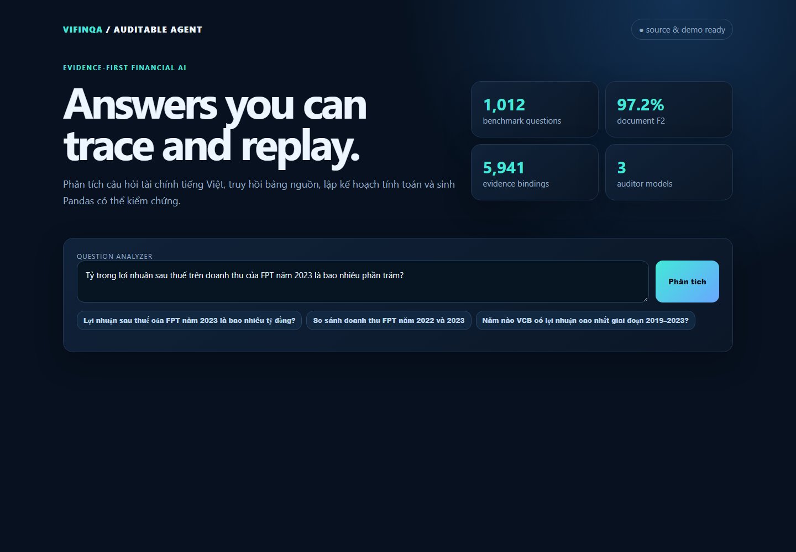

# ViFinQA Auditable Financial Agent

[](https://github.com/nganduong-123/vifinqa-auditable-agent/actions/workflows/ci.yml)

**Portfolio maintainer:** Dương Thị Ngân<br>
**Core:** Vietnamese financial question answering, evidence retrieval and safe Text-to-Pandas execution.

This repository is an extended fork of the LastDance ROAD TO AI 2026 Stage 2
submission. The original Git history and upstream link are retained. The
portfolio version adds a general-question path, richer intent parsing, a
dependency-light web demo, project diagnostics, Windows-safe release checks,
automated tests and CI. See [Portfolio notes](Docs/PORTFOLIO.md) for the exact
scope of the added work.

## Portfolio demo

The demo runs without the private competition dataset and presents the parsing
and project-health layers. With the ViFinQA data, SQLite warehouse and planner
endpoint configured, the existing retrieval, grounding and execution pipeline
can answer new questions end to end.

```bash
python -m pip install -e .
vifinqa-doctor
vifinqa-demo --port 8000
```

Open <http://127.0.0.1:8000> and try:

```text
Tỷ trọng lợi nhuận sau thuế trên doanh thu của FPT năm 2023 là bao nhiêu phần trăm?
```



### Portfolio additions

- Structured Vietnamese intent parsing for entities, year ranges, scope,
  metrics, units, operations, constraints and ambiguity reporting.
- General pipeline that persists auditable JSONL results and uses grounded
  plans instead of the previous placeholder execution path.
- Web dashboard and JSON endpoints: `GET /api/health` and `POST /api/analyze`.
- Cross-platform locked-plan checksum verification through normalized LF input.
- Unit, invariance, leakage and diagnostics tests with GitHub Actions CI.

---

## Original competition system

Giải pháp của đội **lastdance** cho ROAD TO AI 2026 – Stage 2: Financial Table Retrieval & Text-to-Pandas Query Generation.

Hệ thống xây dựng warehouse từ dữ liệu báo cáo tài chính do Ban Tổ chức cung cấp, truy hồi bảng/ô nguồn, trích xuất evidence CSV, sinh câu lệnh Pandas, thực thi trong sandbox và kiểm tra provenance trước khi đóng gói `submission.zip`.

## Kiến trúc

```text
Câu hỏi tiếng Việt
→ warehouse SQLite + FTS5
→ document/table/row retrieval
→ FinancialPlan / execution plan
→ evidence CSV
→ pandas query
→ sandbox execution
→ schema + replay + provenance validation
→ submission.zip
```

Artifact release đã được kiểm tra trên:

- 1.012 câu hỏi;
- 1.012/1.012 pandas query replay thành công;
- 5.941 evidence CSV;
- 5.941/5.941 provenance bindings;
- 2.842 bảng nguồn;
- `dataflow_gate=PASS`;
- `zero_weight_gate=PASS`.

## Cấu trúc repository

```text
analysis/                 FinancialPlan schema và source-cell audit
configs/                  Release config và execution plan
Docs/                     Kiến trúc, dữ liệu, mô hình, tái lập
scripts/                  Modal planner/critic và release utilities
src/vifinqa/              Toàn bộ source code
tests/                    Unit, invariance và leakage tests
submission_materials/     Hồ sơ thuyết minh nghiệm thu
```

Dữ liệu BTC, database dẫn xuất và outputs không được commit vào repository. Các artifact này được cung cấp qua link chia sẻ riêng trong hồ sơ nghiệm thu.

## Yêu cầu môi trường

- Linux hoặc macOS 64-bit;
- Python 3.11;
- SQLite có JSON1 và FTS5;
- tối thiểu 8 GB RAM và 4 GB disk;
- GPU không bắt buộc cho build/replay release;
- H200/A100 80 GB chỉ dùng khi tái chạy semantic audit bằng LLM.

## Cài đặt

```bash
python3.11 -m venv .venv
source .venv/bin/activate
python -m pip install --upgrade pip
python -m pip install -e . -r requirements-dev.txt
```

## Chuẩn bị dữ liệu

Tải dữ liệu từ link được cung cấp trong hồ sơ nghiệm thu và giải nén theo cấu trúc:

```text
ViFinQA/
├── questions/questions.jsonl
├── code_stock.csv
└── financial_statements/
```

## Build bài nộp từ đầu

```bash
PYTHONPATH=src python -m vifinqa.release \
  --config configs/release.json build \
  --output-dir outputs/release_build/submission \
  --rebuild-database
```

Nếu đã có `artifacts/vifinqa.db`, bỏ `--rebuild-database`.

Output: `outputs/release_build/submission.zip`.

## Replay và validation

```bash
PYTHONPATH=src python -m vifinqa.submission_validation \
  --zip outputs/release_build/submission.zip \
  --database artifacts/vifinqa.db
```

Kết quả kỳ vọng:

```text
valid               true
items               1012
replayed            1012
evidence_files      5941
provenance_bindings 5941
dataflow_gate       PASS
zero_weight_gate    PASS
```

## Chạy test

```bash
PYTHONPATH=src pytest -q
```

## Checkpoint

Các checkpoint được pin bằng Git revision trong `configs/release.json`:

- `Qwen/Qwen2.5-14B-Instruct` – planner/reranker;
- `deepseek-ai/DeepSeek-R1-Distill-Qwen-14B` – critic;
- `Qwen/Qwen3-14B` – tiebreak/critic.

Chi tiết tải checkpoint và cấu hình inference xem [Docs/MODELS.md](Docs/MODELS.md).

## Tài liệu

- [Kiến trúc](Docs/ARCHITECTURE.md)
- [Dữ liệu](Docs/DATA.md)
- [Mô hình](Docs/MODELS.md)
- [Hướng dẫn tái lập](Docs/REPRODUCE.md)
- [Hồ sơ thuyết minh](submission_materials/README_NGHIEM_THU.md)

## Bảo mật và dữ liệu

- Không commit dữ liệu BTC, database, checkpoint hoặc credentials.
- Token Modal/Hugging Face chỉ được truyền qua secret manager hoặc biến môi trường.
- Mỗi answer được tính trực tiếp từ evidence CSV bằng pandas query tại thời điểm thực thi.
- Mọi evidence CSV đều có thể đối chiếu về bảng nguồn BTC.

